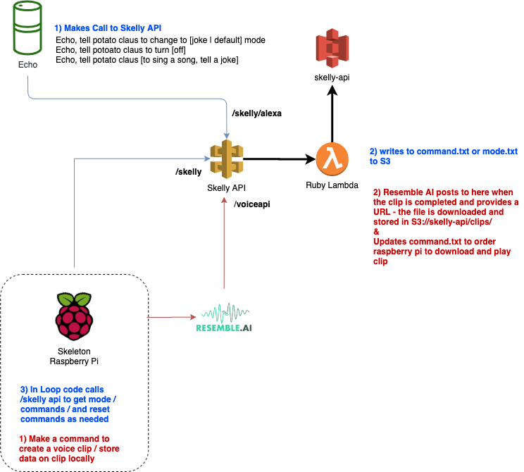

## What Is This
TBD

There are three main files:
### potatoBot.py
This file runs the skeleton - it needs to run always. There are debug methods that show output.
### potatoSay.py
This file is a CLI that allows you to generate ai voices from resemble ai or say something already in the database.
### scheduleEvent.py
This file allows you schedule Potato to say that exist in the DB or create a new saying using potatoSay.py

## Dependencies
Resemble.ai - This app we utilize the API to generate a skeleton voice. This is used for potatoSay and tools/generateVoice.py

## Set Up / Dev
TBD

## Architecture

## LOST
Some of the system commands to prep the raspberry pi are not recorded, but generally:
- Starting Pigpoid at boot
- Ensuring Legacy Camera Support in raspi-config
- Ensuring USB Audio in raspi-config
- Installing Python / System Libs
- Creating and placing AWS CREDS
